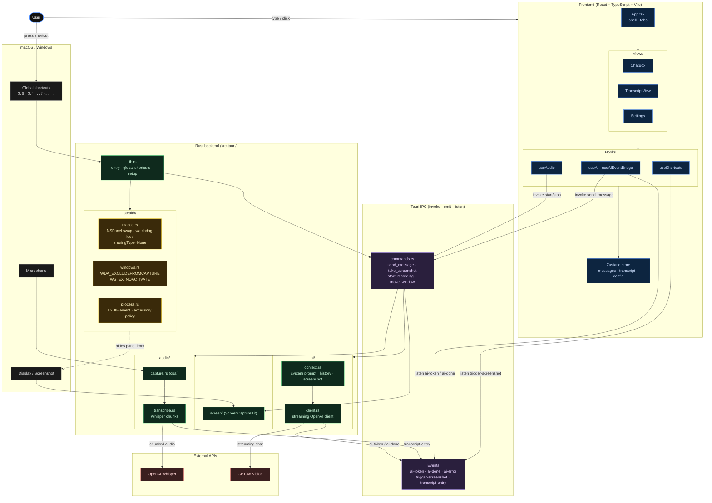

# Invisible Agent

A native desktop interview assistant that floats over any window you're in, including full-screen Zoom, Meet, Teams, Chrome, and IDEs, while remaining **completely invisible** to anything capturing your screen. Built with Tauri 2 (Rust + WebView).

## Architecture at a Glance



Legend: <span title="blue">frontend</span> · <span title="purple">Tauri IPC</span> · <span title="green">Rust backend</span> · <span title="yellow">stealth layer</span> · <span title="red">external APIs</span>. The stealth layer is a cross-cutting concern — it intercepts the path from the panel to the display so Zoom / ScreenCaptureKit / `CGWindowList` never see us.

## Features

### Invisibility
- **Screen-share invisible**: `NSWindowSharingType.none` (macOS) / `WDA_EXCLUDEFROMCAPTURE` (Windows) excludes the window from every capture API — Zoom, Meet, Teams, QuickTime, `screencapture`, ScreenCaptureKit, etc.
- **Hover over full-screen apps**: The window is converted at runtime from `NSWindow` → `NSPanel` with the `nonactivatingPanel` style mask and promoted to `kCGScreenSaverWindowLevelKey` (1000), so it sits on top of maximized / full-screen windows without being dragged into their Space.
- **Cross-Space**: `CanJoinAllSpaces | FullScreenAuxiliary` collection behavior means the panel follows you across Mission Control Spaces and appears over full-screen apps instead of being locked to the desktop.
- **No focus stealing**: `nonactivatingPanel` + `becomesKeyOnlyIfNeeded` + `hidesOnDeactivate = false` — clicking the panel never activates the app or triggers `window.blur` on the site you're interviewing in (no Cluely-style "tab switched" signal).
- **Hidden from Dock & Cmd+Tab**: `LSUIElement = true` and `NSApplicationActivationPolicy.accessory`.
- **Idempotent watchdog loop**: A 250 ms main-thread poll re-asserts stealth properties after Space changes / full-screen transitions, but only writes when a property has actually drifted, so the WebView's `backdrop-filter` never flickers.

See [`docs/STEALTH.md`](./docs/STEALTH.md) for the full breakdown.

### Assistant
- **Audio transcription**: Microphone capture via `cpal`, transcribed in rolling chunks by OpenAI Whisper.
- **Screenshot + Vision**: `Cmd+\`` screenshots the screen and sends it to GPT-4o Vision along with the full transcript, chat history, resume/background, and custom instructions.
- **Structured answers**: AI responses are formatted as *Approach → Steps → Solution → Talking Points → Follow-ups* so you can speak fluently from the panel.
- **Streaming UI**: Responses stream token-by-token into a small draggable chat overlay.
- **Persistent config**: API key, model, base URL, and resume are saved to `localStorage`.

## Keyboard Shortcuts

| Shortcut | Action |
|----------|--------|
| `⌘ B` | Toggle panel visibility |
| `⌘ \`` | Screenshot + ask AI |
| `⌘ ⇧ ↑ ↓ ← →` | Move panel 100 px in that direction |

## Prerequisites

- [Rust](https://rustup.rs/) 1.77+
- [Node.js](https://nodejs.org/) 18+
- macOS 12.3+ (ScreenCaptureKit) or Windows 10+ (`WDA_EXCLUDEFROMCAPTURE`)
- OpenAI API key (for Whisper + GPT-4o)

## Setup

```bash
# Install dependencies
npm install

# Run in development mode
npm run tauri:dev

# Run in production
npm run tauri:build
```

On first launch macOS will prompt for **Microphone** and **Screen Recording** permissions — both are required for audio capture and screenshots respectively.

## Configuration

1. Launch the app.
2. Open the Settings tab (gear icon).
3. Enter your OpenAI API key.
4. (Optional) Paste your resume / background text for context-aware answers.
5. Select a model (`gpt-4o`, `gpt-4o-mini`, etc.) and, if using a proxy, a base URL.

## Architecture

```
src-tauri/                  Rust backend (Tauri 2)
  src/
    stealth/                Platform invisibility layers
      macos.rs              NSPanel conversion, level/collection-behavior,
                            sharingType=None, watchdog reassertion loop
      windows.rs            SetWindowDisplayAffinity, WS_EX_NOACTIVATE
      screen_share.rs       Capture-exclusion entry point
      focus.rs              Non-activating panel style
      process.rs            Hide from Dock / Cmd+Tab
    audio/                  cpal mic capture + Whisper streaming
    screen/                 screencapture / ScreenCaptureKit
    ai/                     Context builder + OpenAI streaming client
    commands.rs             Tauri IPC commands
    lib.rs                  Entry point, global shortcuts

src/                        React + TypeScript frontend
  components/               ChatBox, TranscriptView, Settings
  hooks/                    useAI, useAudio, useShortcuts
  stores/                   Zustand state management
  index.css                 Glass aesthetic (backdrop-filter)

docs/
  STEALTH.md                How invisibility works
```

## How It Works (TL;DR)

Three OS-level tricks running simultaneously:

1. **Invisible to capture** — Every `NSWindow` in the process has its `sharingType` pinned to `None`, so ScreenCaptureKit / CGWindowList / the legacy capture pipeline skip it entirely.
2. **Visible to you, anywhere** — The window is dynamically reclassified as an `NSPanel` with `nonactivatingPanel` + `floatingPanel`, promoted to the screen-saver window level, and granted `CanJoinAllSpaces | FullScreenAuxiliary` so it floats above *any* window — full-screen Zoom included.
3. **Undetectable by heuristics** — No focus stealing, no Dock icon, no Cmd+Tab entry, no taskbar. The Zoom/Meet tab never fires `window.blur`, `visibilitychange`, or focus events when you click us.

Read the full writeup in [`docs/STEALTH.md`](./docs/STEALTH.md).

## License

MIT
